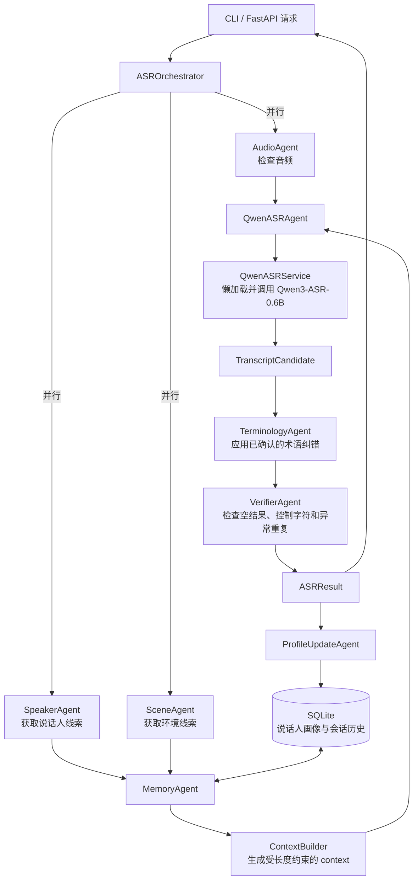

# Multi-Agent ASR

这是一个建立在 Qwen3-ASR 之上的多智能体语音识别开发仓库。Qwen3-ASR 负责转写；本项目负责音频检查、说话人线索、场景线索、历史记忆、上下文构建、结果校验和 API 编排。

## 当前能力

- 懒加载 Qwen3-ASR，启动 API 时不会立即占用 GPU。
- 使用 SQLite 保存说话人画像和最近转写。
- 把说话人、场景、常用术语、历史纠错和最近对话整理成 `context`。
- 术语纠错智能体会应用说话人画像中已经确认的精确纠错，并返回纠错审计记录。
- 提供 FastAPI 健康检查、画像管理和转写接口。
- 说话人与场景智能体已经定义稳定接口，当前基础实现接受上游提示，后续可接入 pyannote、SpeechBrain、AST 或 PANNs。
- 校验智能体当前执行基础完整性检查，后续可以接入 ForcedAligner 和二次解码。

## 多智能体架构

项目采用“中心编排器 + 专职 Agent + 共享记忆”的结构。每个 Agent 只负责一个明确任务，通过 `schemas/models.py` 中的结构化对象交换数据。Qwen3-ASR 作为核心转写 Agent，其他 Agent 负责补充声学线索、历史上下文、术语修正和结果校验。



音频检查、说话人分析和场景分析会并行执行。Qwen3-ASR 是当前唯一使用 GPU 的大模型，其他 Agent 默认在 CPU 上执行。模型服务使用异步锁串行进入单个模型实例，避免同一张 GPU 重复加载权重。

### Agent 职责

| 组件 | 输入 | 输出 | 当前实现 |
|---|---|---|---|
| `ASROrchestrator` | `TranscriptionInput` | `ASRResult` | 调度整个转写流程并传递共享状态 |
| `AudioAgent` | 音频路径 | `AudioInfo` | 检查文件，读取时长、采样率和通道数 |
| `SpeakerAgent` | 音频、`speaker_hint` | `SpeakerObservation` | 使用调用方提供的说话人提示；预留声纹模型接口 |
| `SceneAgent` | 音频、`scene_hint` | `SceneObservation` | 使用调用方提供的环境提示；预留环境分类模型接口 |
| `MemoryAgent` | 会话 ID、说话人、场景 | 画像、最近对话、`context` | 查询 SQLite 并调用 `ContextBuilder` |
| `QwenASRAgent` | 音频、`context`、语言 | `TranscriptCandidate` | 通过 `QwenASRService` 调用 Qwen3-ASR-0.6B |
| `TerminologyAgent` | 候选文本、说话人画像 | 修正后的候选文本 | 对确认过的纠错词典执行单次最长匹配，并记录 `applied_corrections` |
| `VerifierAgent` | 候选文本 | `VerificationResult` | 检查空文本、控制字符和异常重复 |
| `ProfileUpdateAgent` | 最终结果 | SQLite 记录 | 保存转写；后续检索只使用通过校验的历史 |

`QwenASRService` 属于模型服务层，负责模型懒加载、设备和精度配置、GPU 并发控制以及官方结果格式转换。Agent 层只依赖它提供的统一转写接口，因此以后可以增加 Whisper、FunASR 或远程 ASR 服务，而不改动编排器的数据流。

### 一次请求的执行顺序

1. API 或 CLI 创建 `TranscriptionInput`。
2. `AudioAgent`、`SpeakerAgent` 和 `SceneAgent` 并行分析输入。
3. `MemoryAgent` 根据说话人画像和当前会话生成 `context`。
4. `QwenASRAgent` 调用 Qwen3-ASR-0.6B 生成原始候选文本。
5. `TerminologyAgent` 应用画像中已经人工确认的精确纠错。
6. `VerifierAgent` 检查结果并生成告警。
7. `ProfileUpdateAgent` 保存本次结果；通过校验的文本可以成为下一次请求的短期历史。
8. API 返回文本、语言、场景、校验状态、实际使用的 `context`、时间戳和纠错记录。

### 共享数据结构

| 数据结构 | 用途 |
|---|---|
| `TranscriptionInput` | 音频路径、会话 ID、说话人和场景提示、语言、显式上下文 |
| `SpeakerProfile` | 说话人名称、口音、常用术语、确认过的纠错和常见环境 |
| `TranscriptCandidate` | Qwen3-ASR 产生并在 Agent 间传递的候选结果 |
| `AppliedCorrection` | 记录原词、替换词和出现次数，保证纠错过程可审计 |
| `VerificationResult` | 校验是否通过、告警信息和可选重试上下文 |
| `ASRResult` | API 和 CLI 最终返回的统一结果 |

### 代码目录映射

```text
src/multi_agent_asr/
├── agents/
│   ├── orchestrator.py          # 中心编排器
│   ├── audio_agent.py           # 音频检查
│   ├── speaker_agent.py         # 说话人线索
│   ├── scene_agent.py           # 环境线索
│   ├── memory_agent.py          # 画像和会话记忆
│   ├── qwen_asr_agent.py        # Qwen3-ASR Agent 接口
│   ├── terminology_agent.py     # 术语纠错
│   ├── verifier_agent.py        # 结果校验
│   └── profile_update_agent.py  # 历史写入
├── services/
│   └── qwen_service.py          # 模型加载和推理适配
├── memory/
│   ├── repository.py            # SQLite 持久化
│   └── context_builder.py       # context 构建策略
├── schemas/
│   └── models.py                # Agent 共享数据契约
├── api/
│   └── app.py                   # FastAPI 接口
├── bootstrap.py                 # 依赖装配
├── config.py                    # 环境配置
└── cli.py                       # 命令行入口
```

## 仓库边界

```text
./qwen3-asr       Qwen3-ASR 底层源码
./multi-agent-asr 本项目源码
./data/multi-agent-asr 运行数据与 SQLite
./runs/multi-agent-asr 实验输出与日志
```

模型权重由 Hugging Face 缓存管理，不提交到本仓库。

## 环境

首次初始化推荐从已经验证过的 `qwen3-asr` 环境克隆：

```bash
cd ./multi-agent-asr
bash scripts/bootstrap_wsl.sh
```

以后进入环境：

```bash
source ./miniforge3/etc/profile.d/conda.sh
conda activate multi-agent-asr
```

配置文件：

```bash
cp .env.example .env
```

默认模型为 `Qwen/Qwen3-ASR-0.6B`，适合 8 GB 显存的本地开发。如需时间戳，在 `.env` 中设置：

```text
MASR_FORCED_ALIGNER_MODEL_PATH=Qwen/Qwen3-ForcedAligner-0.6B
```

## 初始化与验证

```bash
multi-agent-asr init-db
python -m pytest
python -m ruff check src tests
```

## 启动 API

```bash
multi-agent-asr serve
```

健康检查：

```bash
curl http://127.0.0.1:8000/health
```

写入说话人画像：

```bash
curl -X PUT http://127.0.0.1:8000/v1/profiles/speaker_001 \
  -H 'Content-Type: application/json' \
  -d '{
    "speaker_id": "speaker_001",
    "display_name": "张三",
    "accent": "四川口音",
    "accent_confidence": 0.81,
    "frequent_terms": ["Qwen3-ASR", "ForcedAligner"],
    "corrections": {"福斯阿莱纳": "ForcedAligner"},
    "environments": ["汽车驾驶舱"]
  }'
```

转写本地音频：

```bash
curl -X POST http://127.0.0.1:8000/v1/transcriptions \
  -H 'Content-Type: application/json' \
  -d '{
    "audio_path": "./data/multi-agent-asr/raw/example.wav",
    "session_id": "demo-session",
    "speaker_hint": "speaker_001",
    "scene_hint": "汽车驾驶舱",
    "language": "Chinese"
  }'
```

## 命令行转写

```bash
multi-agent-asr transcribe \
  ./data/multi-agent-asr/raw/example.wav \
  --session-id demo-session \
  --speaker speaker_001 \
  --language Chinese
```

## 开发入口

- `src/multi_agent_asr/agents/orchestrator.py`：整体流程。
- `src/multi_agent_asr/services/qwen_service.py`：Qwen3-ASR 模型封装。
- `src/multi_agent_asr/memory/repository.py`：SQLite 持久化。
- `src/multi_agent_asr/memory/context_builder.py`：上下文生成策略。
- `src/multi_agent_asr/agents/terminology_agent.py`：应用画像中的已确认术语纠错。
- `src/multi_agent_asr/api/app.py`：HTTP API。
- `docs/architecture.md`：架构与扩展约束。
