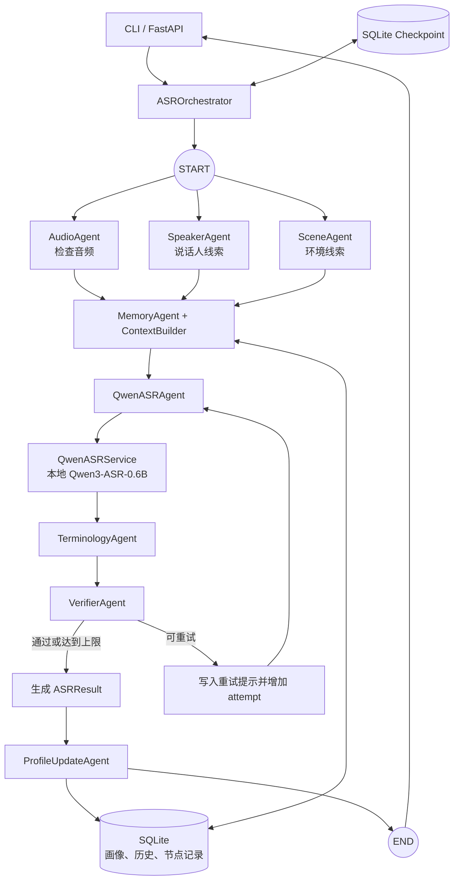

# 施工中仓库
---

# Multi-Agent ASR

这是一个建立在 Qwen3-ASR 之上的多智能体语音识别项目。Qwen3-ASR 负责转写，LangGraph 负责工作流编排，项目中的专职 Agent 负责音频检查、说话人和场景线索、历史记忆、术语修正、结果校验与记录。

## 框架选型

项目使用现有的 [LangGraph](https://github.com/langchain-ai/langgraph) 状态图框架，不再由 `ASROrchestrator` 手写流程控制。LangGraph 提供：

- 并行节点和汇合依赖；
- 根据校验结果选择结束或重试；
- SQLite Checkpoint，可保存每一步图状态；
- 稳定的节点边界，便于以后替换 Agent 实现。

LangGraph 本身不提供识别模型，也不要求 Anthropic、OpenAI 或其他云端模型密钥。官方教程中的 Anthropic Key 只用于调用 Claude 示例。本项目的 `asr` 节点调用本地 `QwenASRService`，图编排、Checkpoint 和测试均可离线运行。

## 当前能力

- 使用 LangGraph 编排完整 ASR 状态图。
- 并行执行音频检查、说话人分析和场景分析。
- 懒加载 Qwen3-ASR，启动 API 和运行单元测试时不会加载模型权重。
- 使用 SQLite 保存说话人画像、已验证的最近转写和节点运行记录。
- 使用 SQLite Checkpoint 保存每次 LangGraph 执行状态。
- 把说话人、场景、常用术语、历史纠错和最近对话整理为受长度约束的 `context`。
- 对空文本、控制字符和异常重复执行校验；失败后可携带定向提示再次调用 ASR。
- 对说话人画像中已经确认的术语执行精确修正，并返回纠错审计记录。
- 通过 `run_id` 查询本次请求中每个节点的状态、耗时、attempt 和错误。

## 多智能体状态图



`AudioAgent`、`SpeakerAgent` 和 `SceneAgent` 从 `START` 同时启动。LangGraph 等三个节点全部完成后才进入 `context` 节点。`verify` 节点通过条件边决定进入 `finalize`，或经过 `retry` 回到 `asr`。`MASR_MAX_ASR_RETRIES` 限制额外识别次数，防止无限循环。

每次请求都会生成新的 `run_id`，Checkpoint 的 `thread_id` 为：

```text
{session_id}:{run_id}
```

这样同一会话的不同请求不会意外读取上一次请求的图状态。

## Agent 与服务职责

| 组件 | 输入 | 输出 | 职责 |
|---|---|---|---|
| `ASROrchestrator` | `TranscriptionInput` | `ASRResult` | 创建运行 ID、调用 LangGraph、管理 Checkpoint 生命周期 |
| `AudioAgent` | 音频路径 | `AudioInfo` | 检查文件并读取时长、采样率和通道数 |
| `SpeakerAgent` | 音频、`speaker_hint` | `SpeakerObservation` | 当前使用显式提示，预留声纹模型接口 |
| `SceneAgent` | 音频、`scene_hint` | `SceneObservation` | 当前使用显式提示，预留声学场景分类接口 |
| `MemoryAgent` | 会话、说话人、场景 | 画像和 `context` | 查询长期画像与短期会话历史 |
| `QwenASRAgent` | 音频、语言、`context` | `TranscriptCandidate` | 调用统一的 Qwen3-ASR 服务接口 |
| `TerminologyAgent` | 候选文本、画像 | 修正后的候选文本 | 应用已经确认的最长术语匹配 |
| `VerifierAgent` | 候选文本 | `VerificationResult` | 检查空文本、控制字符和异常重复 |
| `ProfileUpdateAgent` | `ASRResult` | SQLite 记录 | 保存结果，通过校验的文本可进入后续上下文 |
| `QwenASRService` | ASR 参数 | `TranscriptCandidate` | 懒加载模型、限制 GPU 并发并转换官方返回格式 |
| `SqliteRunRepository` | 节点事件 | `NodeRunRecord` | 记录节点状态、耗时、attempt 和错误 |

Qwen3-ASR 是当前唯一使用 GPU 的大模型。其他 Agent 的基础实现运行在 CPU 上，增加 Agent 不会复制一份 Qwen 权重。后续接入说话人或场景模型时，应按显存和内存预算选择轻量模型并保持懒加载。

## 两类 SQLite 状态

| 数据 | 默认位置 | 用途 |
|---|---|---|
| 业务记忆与节点记录 | `~/data/multi-agent-asr/state/memory.sqlite3` | 画像、已验证历史、`node_runs` |
| LangGraph Checkpoint | `~/data/multi-agent-asr/state/checkpoints.sqlite3` | 图状态、节点版本和恢复信息 |

数据库、模型权重、音频、日志和生成结果都被排除在 Git 提交之外。

## 代码结构

```text
src/multi_agent_asr/
├── agents/
│   ├── orchestrator.py          # LangGraph 生命周期与统一入口
│   ├── audio_agent.py
│   ├── speaker_agent.py
│   ├── scene_agent.py
│   ├── memory_agent.py
│   ├── qwen_asr_agent.py
│   ├── terminology_agent.py
│   ├── verifier_agent.py
│   └── profile_update_agent.py
├── graph/
│   ├── state.py                 # ASRGraphState
│   ├── nodes.py                 # Agent 到图节点的适配
│   ├── routing.py               # 校验后的条件路由
│   └── workflow.py              # StateGraph 拓扑与编译
├── observability/
│   └── repository.py            # 节点级 SQLite 运行记录
├── services/
│   └── qwen_service.py          # Qwen3-ASR 懒加载与推理适配
├── memory/
│   ├── repository.py            # 画像与会话历史
│   └── context_builder.py       # 上下文构建策略
├── schemas/
│   └── models.py                # Agent 共享的数据契约
├── api/
│   └── app.py                   # FastAPI 接口与资源释放
├── bootstrap.py                 # 依赖装配
├── config.py                    # 环境配置
└── cli.py                       # 命令行入口
```

## 环境安装

首次初始化可从已验证的 Qwen3-ASR 环境克隆：

```bash
cd /home/jiangsongbo/multi-agent-asr
bash scripts/bootstrap_wsl.sh
```

进入环境并安装当前项目依赖：

```bash
source /home/jiangsongbo/miniforge3/etc/profile.d/conda.sh
conda activate multi-agent-asr
python -m pip install -e ".[dev]"
```

创建本地配置：

```bash
cp .env.example .env
```

关键配置：

```text
MASR_ASR_MODEL_PATH=Qwen/Qwen3-ASR-0.6B
MASR_DATABASE_PATH=/home/jiangsongbo/data/multi-agent-asr/state/memory.sqlite3
MASR_CHECKPOINT_DATABASE_PATH=/home/jiangsongbo/data/multi-agent-asr/state/checkpoints.sqlite3
MASR_MAX_ASR_RETRIES=1
```

如需时间戳，可设置 ForcedAligner：

```text
MASR_FORCED_ALIGNER_MODEL_PATH=Qwen/Qwen3-ForcedAligner-0.6B
```

## 初始化与验证

```bash
multi-agent-asr init-db
python -m ruff check src tests scripts/smoke_test.py
python -m pytest
python scripts/smoke_test.py
```

测试中的 ASR 使用假服务，不下载或加载模型权重。

## 启动 API

```bash
multi-agent-asr serve
```

接口文档：

```text
http://127.0.0.1:8000/docs
```

健康检查：

```bash
curl http://127.0.0.1:8000/health
```

响应中的 `model_loaded: false` 表示 API 启动没有提前加载 Qwen3-ASR。

## 写入说话人画像

```bash
curl -X PUT http://127.0.0.1:8000/v1/profiles/speaker_001 \
  -H 'Content-Type: application/json' \
  -d '{
    "speaker_id": "speaker_001",
    "display_name": "张三",
    "accent": "四川口音",
    "accent_confidence": 0.81,
    "frequent_terms": ["Qwen3-ASR", "ForcedAligner"],
    "corrections": {"福斯阿莱纳": "ForcedAligner"},
    "environments": ["汽车驾驶舱"]
  }'
```

## 发起转写

```bash
curl -X POST http://127.0.0.1:8000/v1/transcriptions \
  -H 'Content-Type: application/json' \
  -d '{
    "audio_path": "/home/jiangsongbo/data/multi-agent-asr/raw/example.wav",
    "session_id": "demo-session",
    "speaker_hint": "speaker_001",
    "scene_hint": "汽车驾驶舱",
    "language": "Chinese"
  }'
```

响应会包含 `run_id`。使用它查询节点运行明细：

```bash
curl http://127.0.0.1:8000/v1/runs/返回的run_id
```

## 命令行转写

```bash
multi-agent-asr transcribe \
  /home/jiangsongbo/data/multi-agent-asr/raw/example.wav \
  --session-id demo-session \
  --speaker speaker_001 \
  --scene 汽车驾驶舱 \
  --language Chinese
```

## 扩展原则

- 新的模型适配放入 `services/`，图的流程判断放入 `graph/`。
- Agent 之间只交换 `schemas/models.py` 中定义的结构化对象。
- 上下文可帮助消歧，但不能覆盖音频证据。
- 说话人、场景、校验或新 ASR 实现应替换对应节点依赖，无需重写整个状态图。
- 新增条件分支时同时增加路由测试、Checkpoint 测试和节点记录断言。
