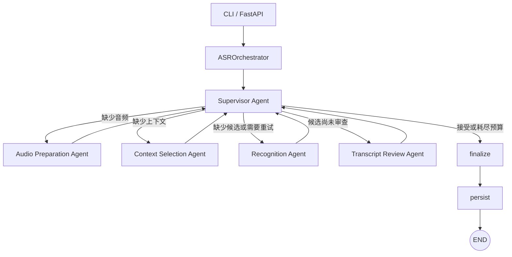

# Multi-Agent ASR

这是一个建立在 Qwen3-ASR 之上的本地多智能体语音识别项目。系统使用 LangGraph 编排五个具有明确决策职责的 Agent，并使用确定性工具完成音频处理、上下文渲染、术语替换、质量检查和持久化。

## 五个 Agent

| Agent | 目标 | 主要动作 |
| --- | --- | --- |
| Supervisor Agent | 根据黑板状态选择下一步并管理重试 | audio、context、recognition、review、finalize |
| Audio Preparation Agent | 产生有效单声道音频 | accept、downmix、reject |
| Context Selection Agent | 选择可信且受预算约束的上下文 | personalized、session_only、budget_reduced |
| Recognition Agent | 根据上下文和审查反馈生成候选 | with_context、without_context、retry_with_feedback |
| Transcript Review Agent | 选择检查并决定接受或重试 | accept、retry、finalize_unverified |

`SpeakerResolver`、`SceneResolver`、`TerminologyCorrector`、`TranscriptValidator`、`HistoryRecorder`、finalize 和 persist 都是工具或固定节点，不称为 Agent。

## Supervisor 状态图


```mermaid
flowchart TD
    Client[CLI / FastAPI] --> O[ASROrchestrator]
    O --> S[Supervisor Agent]
    S -->|缺少音频| A[Audio Preparation Agent]
    A --> S
    S -->|缺少上下文| C[Context Selection Agent]
    C --> S
    S -->|缺少候选或需要重试| R[Recognition Agent]
    R --> S
    S -->|候选尚未审查| V[Transcript Review Agent]
    V --> S
    S -->|接受或耗尽预算| F[finalize]
    F --> P[persist]
    P --> End((END))
```

Review 的告警经过 Supervisor 返回 Recognition。重试时会清除旧候选，并把失败原因加入下一轮有效上下文。Supervisor 最大步数和 ASR 最大重试次数共同防止无限循环。

## 当前能力

- 多声道音频自动转换为单声道并重新检查。
- 根据身份置信度选择是否使用说话人画像。
- 上下文触及字符预算时调整证据后重新渲染。
- Qwen3-ASR 懒加载，并在同一进程共享唯一模型服务。
- 根据 Review 反馈改变下一轮 Recognition 动作。
- 检查空文本、控制字符、异常重复和时间戳一致性。
- 使用 SQLite 保存画像、可信会话历史、运行记录和 LangGraph Checkpoint。
- 使用 `run_id` 查询节点状态、耗时、attempt 和错误。

## 代码结构

```text
src/multi_agent_asr/
├── agents/
│   ├── supervisor_agent.py
│   ├── audio_preparation_agent.py
│   ├── context_selection_agent.py
│   ├── recognition_agent.py
│   ├── transcript_review_agent.py
│   └── orchestrator.py
├── tools/
│   ├── audio.py
│   ├── context.py
│   ├── terminology.py
│   ├── transcript.py
│   └── persistence.py
├── graph/
│   ├── state.py
│   ├── nodes.py
│   ├── routing.py
│   └── workflow.py
├── services/
│   └── qwen_service.py
├── memory/
│   ├── repository.py
│   └── context_builder.py
├── schemas/
│   ├── models.py
│   └── agent_models.py
├── observability/
├── api/
├── bootstrap.py
├── config.py
└── cli.py
```

## 环境安装

```bash
cd ~/multi-agent-asr
source ~/miniforge3/etc/profile.d/conda.sh
conda activate multi-agent-asr
python -m pip install -e ".[dev]"
cp .env.example .env
```

关键配置：

```text
MASR_ASR_MODEL_PATH=Qwen/Qwen3-ASR-0.6B
MASR_DATABASE_PATH=./data/state/memory.sqlite3
MASR_CHECKPOINT_DATABASE_PATH=./data/state/checkpoints.sqlite3
MASR_MAX_ASR_RETRIES=1
MASR_SUPERVISOR_MAX_STEPS=16
MASR_AUDIO_AGENT_MAX_STEPS=3
MASR_CONTEXT_AGENT_MAX_STEPS=2
MASR_MIN_SPEAKER_CONFIDENCE=0.5
```

如需时间戳，可设置：

```text
MASR_FORCED_ALIGNER_MODEL_PATH=Qwen/Qwen3-ForcedAligner-0.6B
```

## 初始化与验证

```bash
multi-agent-asr init-db
python -m ruff check src tests scripts
python -m ruff format --check src tests scripts
python -m pytest
python scripts/smoke_test.py
```

测试使用假 ASR 服务，不下载或加载模型。


## 启动 API

```bash
multi-agent-asr serve
```

Swagger 文档：<http://127.0.0.1:8000/docs>

健康检查：

```bash
curl http://127.0.0.1:8000/health
```

`model_loaded: false` 表示服务启动没有加载 Qwen3-ASR 权重。`agent_architecture: supervisor` 表示当前使用 Supervisor 五 Agent 架构。

## 写入说话人画像

```bash
curl -X PUT http://127.0.0.1:8000/v1/profiles/speaker_001 \
  -H 'Content-Type: application/json' \
  -d '{
    "speaker_id": "speaker_001",
    "display_name": "张三",
    "accent": "四川口音",
    "accent_confidence": 0.81,
    "frequent_terms": ["Qwen3-ASR", "ForcedAligner"],
    "corrections": {"福斯阿莱纳": "ForcedAligner"},
    "environments": ["汽车驾驶舱"]
  }'
```

## 发起转写

```bash
curl -X POST http://127.0.0.1:8000/v1/transcriptions \
  -H 'Content-Type: application/json' \
  -d '{
    "audio_path": "/path/to/audio/example.wav",
    "session_id": "demo-session",
    "speaker_hint": "speaker_001",
    "scene_hint": "汽车驾驶舱",
    "language": "Chinese"
  }'
```

使用响应中的 `run_id` 查询执行明细：

```bash
curl http://127.0.0.1:8000/v1/runs/返回的run_id
```

## 查看 Agent 日志

每个 Agent 完成一次决策后，会把结构化日志写入
`data/state/memory.sqlite3` 的 `node_runs.details_json`。日志包含：

完整字段、动作代码和兼容性约定见
[`docs/agent-log-format.md`](docs/agent-log-format.md)。

- Supervisor 的全局观察和路由决策。
- Audio Preparation 的观察、动作和接受或拒绝原因。
- Context Selection 的策略、证据来源和预算调整轨迹。
- Recognition 的识别动作、候选长度、术语纠错和自评。
- Transcript Review 的检查项、告警、反馈和最终决策。

命令行查看指定运行中的 Agent 日志：

```bash
multi-agent-asr agent-log 返回的run_id
```

API 或 Swagger 查看：

```bash
curl http://127.0.0.1:8000/v1/runs/返回的run_id/agent-logs
```

`/v1/runs/{run_id}` 仍返回完整节点记录，其中还包括 `finalize` 和
`persist` 等确定性节点。日志功能启用前产生的历史运行只包含基础节点信息；
新的转写会记录完整的 observation、decision 和 trace。

## 命令行转写

```bash
multi-agent-asr transcribe \
  $HOME/multi-agent-asr/data/raw/example.wav \
  --session-id demo-session \
  --speaker speaker_001 \
  --scene 汽车驾驶舱 \
  --language Chinese
```
